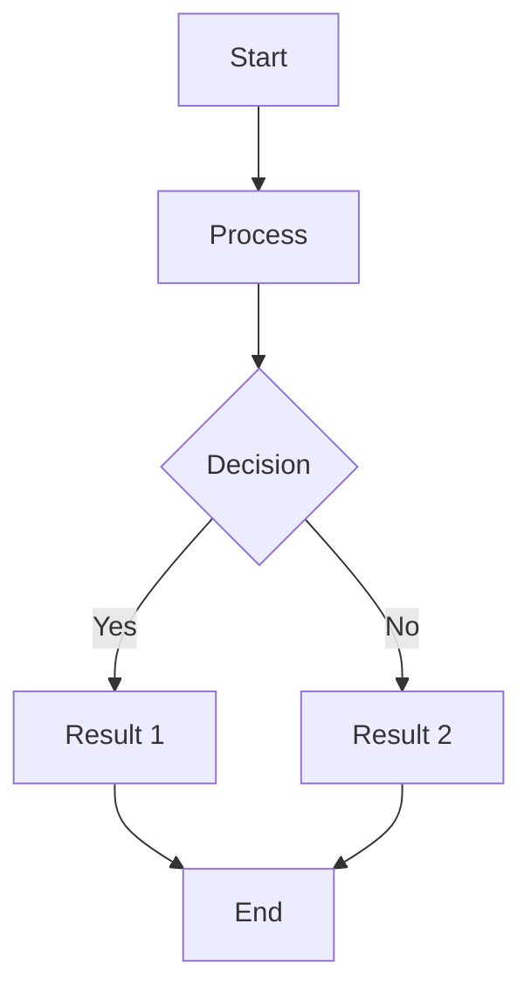

# 마크다운 뷰어 테스트

이것은 **마크다운 뷰어**를 테스트하기 위한 파일입니다.

## 기능 테스트

### 1. 코드 하이라이팅

```rust
fn main() {
    println!("Hello, world!");
}
```

```python
def hello():
    print("Hello, world!")
```

### 2. 테이블 (GFM)

| Header 1 | Header 2 | Header 3 |
|----------|----------|----------|
| Cell 1   | Cell 2   | Cell 3   |
| Cell 4   | Cell 5   | Cell 6   |

### 3. 체크리스트

- [x] 완료된 작업
- [ ] 진행 중인 작업
- [ ] 예정된 작업

### 4. 수학 수식

인라인 수식: $E = mc^2$

디스플레이 수식:

$$
\int_{-\infty}^{\infty} e^{-x^2} dx = \sqrt{\pi}
$$

### 5. Mermaid 다이어그램



## 마크다운 기본 기능

### 텍스트 스타일

- **Bold text**
- *Italic text*
- ***Bold and italic***
- ~~Strikethrough~~

### 링크와 이미지

[GitHub](https://github.com)

### 인용구

> 이것은 인용구입니다.
> 여러 줄로 작성할 수 있습니다.

### 리스트

1. 첫 번째 항목
2. 두 번째 항목
3. 세 번째 항목

- 순서 없는 항목 1
- 순서 없는 항목 2
  - 중첩된 항목
  - 또 다른 중첩 항목

### 코드

인라인 코드: `console.log("Hello")`

---

이제 파일을 수정해서 실시간 업데이트를 테스트해 보세요!
